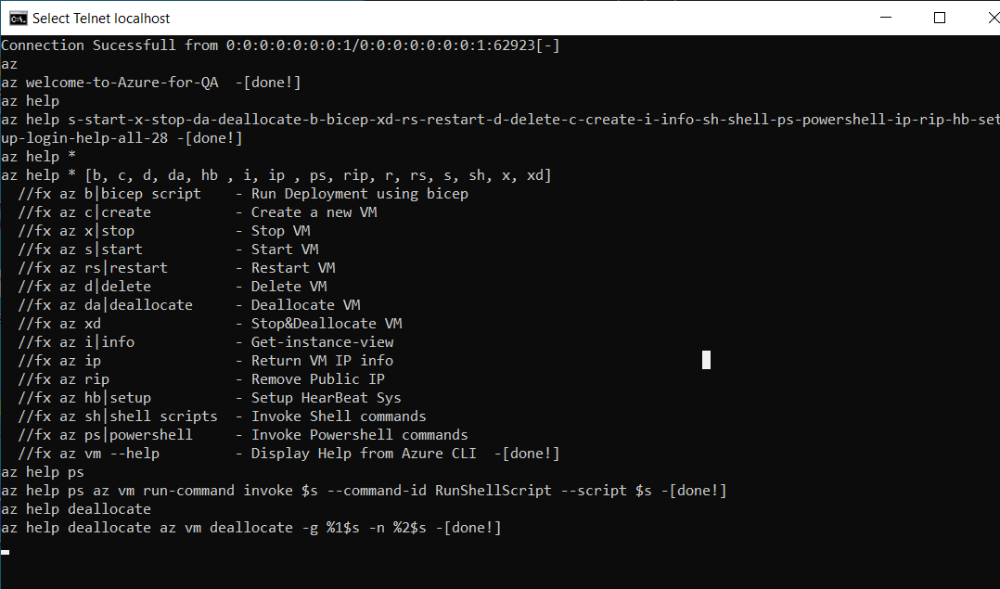
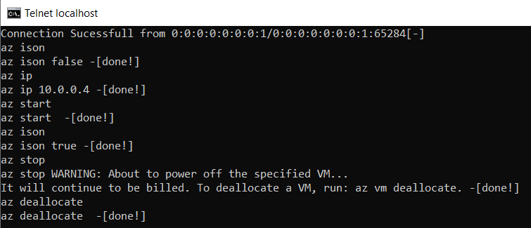

# Azure Demo

This project demonstrates how QA engineers can learn and utilize Azure cloud resources. It includes basic example scripts for interfacing with Azure using Terraform and Bicep. Additionally, the project provides sample code for customizing your own Azure CLI to meet specific needs.I have also included a section covering the top 10+ CLI usage for QA automation task, which includes creating, setting up, updating, deallocating, and removing virtual machines. 


# Enviroment Requirement
`Install az cli`

`Install az install bicep`

`Install [terraform]`

`Java 8 [8 or 11]`

# Azure CLI: create and delete ResourceGroup using 
```bash
  az group create --n MyResourceGroup -l eastus
  az group delete --name MyResourceGroup
```
# Azure Terraform: create and delete ResourceGroup
`terraform init->plan->apply->destroy`

# Terraform [create static webSite using Terraform demo ]
```bash
  cd terraformInfra
  terraform init|plan|apply|destory
```
# Terraform [create-destory VM ]
```bash
  cd terraformInfra
  terraform init|plan|apply|destory
```
# Bicep[create vm by deployment bicep file Using Azure CLI]
```bash
  cd bicep
  az deployment group create -g bicep -f .\createVM.bicep --parameters=parameters.json
```
# Bicep[delete vm by Deploy the Modified Template in Complete Mode]
```bash
  cd bicep
  az deployment group create -g bicep -f .\deleteVM.bicep --mode Complete
```
# Bicep[VM's parameters.json]

  bicep/parameters.json -> define default value for VM settings[rgName,vmName,adminUsername,password]

# Setup Automation tool for using Azure resource
```bash
  git clone https://github.com/ts01soonr/Azure.git
  cd Azure
  start_demo.bat    //for-windows
  sh start_demo.sh  //for-linux/mac
```
# Check whether the setup is ready 
```bash
  telnet localhost 8888
  az
  az help
  az help *
```
# Example output from setup enviroment

if all looks good, then continue with further action

# Create - Update - Stop - Deallocate - Check Status - Delete VM
```bash
  telnet localhost 8888
  #create a new VM
  az create
  #Get-IPs
  az ip
  #remove-publicIP
  az rip
  #Stop
  az stop
  #Deallocate
  az deallocate
  #Delete VM
  az delete
```


# a few Hints : save cost when you are using azure VM for testing
1. remember to deallocate VM after it is power-off
2. remove Public IP or reduce public IP usage if it is possible
3. options: welcome to setup remote control via HBsys. catch me for details [fang@italle.dk]
 


